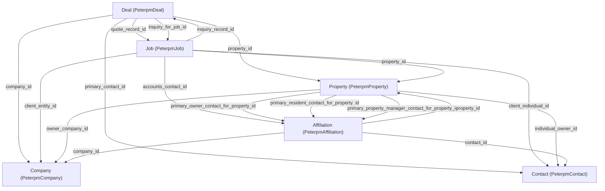

# Inquiry/Deal + Quote/Job Schema Brief

This brief is a communication-ready schema contract for designing a new Inquiry/Deal and Quote/Job layout. It is based on the current `schema/schema.xml` model relationships and the existing inquiry detail handoff behavior.

## Core Models

- `PeterpmDeal` (`Deal`) - Primary inquiry record.
- `PeterpmJob` (`Job`) - Quote/job record linked to an inquiry.
- `PeterpmProperty` (`Property`) - Site/location and ownership context.
- `PeterpmContact` (`Contact`) - Individual customer/person records.
- `PeterpmCompany` (`Company`) - Business customer records.
- `PeterpmAffiliation` (`Affiliation`) - Join model connecting contact/company/property roles.

## Canonical Relationships (FK Names Must Match)

## Layout Data Contract

Use these fields as the minimum contract for a new detail layout.

### Inquiry Header (Deal)

- `id`
- `unique_id`
- `deal_name`
- `inquiry_status` (enum)
- `sales_stage`
- `created_at`
- `expected_close_date`
- `actual_close_date`

### Inquiry Context (Deal)

- `property_id`
- `primary_contact_id`
- `company_id`
- `service_provider_id`
- `type`
- `how_can_we_help`
- `admin_notes`
- `date_job_required_by`

### Quote/Job Summary (Job)

- `id`
- `unique_id`
- `quote_status` (enum)
- `job_status` (enum)
- `quote_date`
- `follow_up_date`
- `date_quote_sent`
- `date_quoted_accepted`
- `quote_total`
- `job_total`

### Billing and Operations (Job)

- `invoice_number`
- `invoice_total`
- `payment_status`
- `accounts_contact_id`
- `admin_recommendation`
- `job_variation_price`

### Property Panel (Property)

- `address_1`
- `address_2`
- `suburb_town`
- `state`
- `postal_code`
- `owner_company_id`
- `individual_owner_id`

### Customer Panels

- `Contact`: `first_name`, `last_name`, `email`, `sms_number`, `phone`
- `Company`: `name`, `phone`, `address`, `city`, `state`, `postal_code`

## Related Records For Lower Tabs

These models already point to inquiry/job/customer/property and can power operational tabs:

- `Note`: `Deal_id`, `Job_id`, `Contact_id`, `Company_id`, `Property_id`
- `Task`: `Deal_id`, `Job_id`, `Contact_id`, `Company_id`, `Property_id`
- `Appointment`: `inquiry_id`, `job_id`, `location_id`, `primary_guest_id`
- `Upload`: `inquiry_id`, `job_id`, `property_name_id`, `customer_id`, `company_id`
- `ForumPost`: `related_inquiry_id`, `related_job_id`, `author_id`
- `ForumComment`: `inquiry_id`, `quote_job_id`, `author_id`

## Non-Regression Handoff Rules

When creating a quote/job from inquiry:

1. Create `Job` with `inquiry_record_id = Deal.id`.
2. After successful create, update the source `Deal`:
   - `inquiry_status = "Quote Created"`
   - `quote_record_id = <createdJobId>`
   - `inquiry_for_job_id = <createdJobId>`

This behavior is part of the current app flow and must not change during layout redesign.

## Recommended UI Zones

- Top bar: inquiry identity, statuses, and core actions.
- Left column: inquiry details + customer/property context.
- Right column: quote/job card, follow-up dates, financial snapshot.
- Lower tabs: notes, tasks, activity, appointments, uploads, forum.

## Claude Handoff Prompt (Copy/Paste)

Design and implement a new Inquiry/Deal + Quote/Job detail layout using this schema contract:

- Use `Deal` as the primary record and `Job` as the linked secondary record.
- Preserve all FK paths and names exactly as documented in the ER diagram.
- Preserve quote handoff behavior: create `Job` with `inquiry_record_id`, then update `Deal` (`inquiry_status`, `quote_record_id`, `inquiry_for_job_id`).
- Ensure the page works for both states: inquiry without quote/job and inquiry with existing quote/job.
- Above the fold, show record identity, statuses, customer/property summary, and primary actions.
- Add resilient section-level loading/empty/error states for each major panel.
